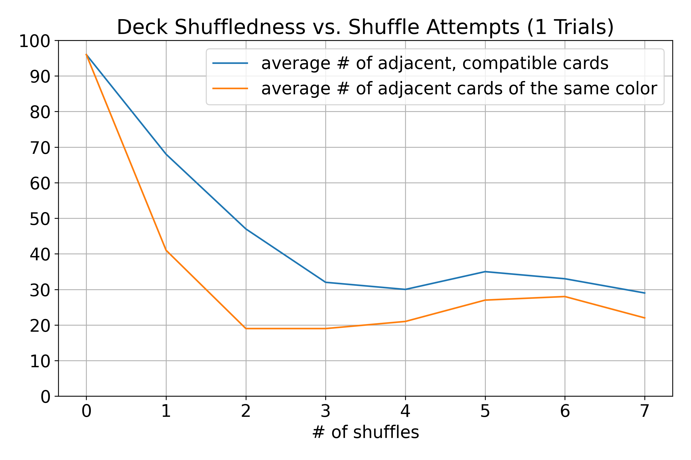
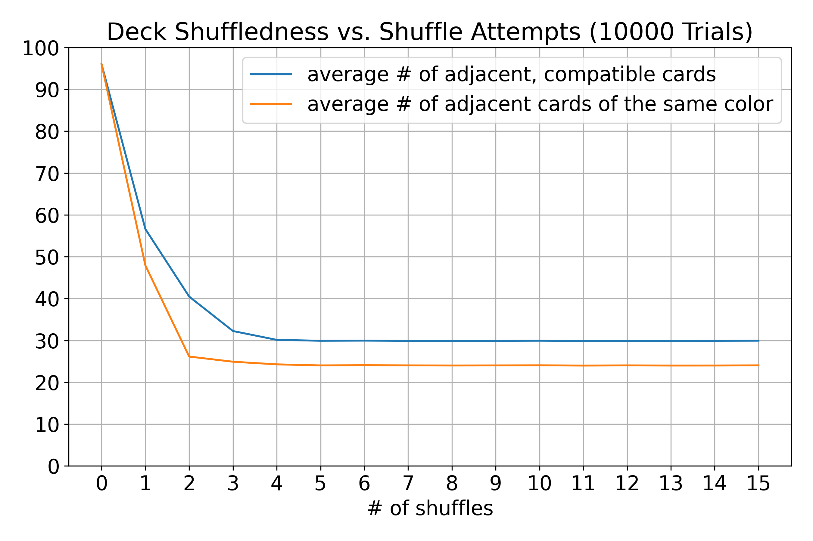

# How many times do you need to shuffle an UNO(!)(R?) deck?
*By Vincent Boling and Irene Hong    
for a presentation in Mr. Hahn's 11th grade Analysis Honors class.*  
   
Reasonably? About 3... . 6 or 7, if you're crazy.

## Intent
To determine the minimum number of times one would reasonably need to shuffle a deck of [UNO](https://en.wikipedia.org/wiki/Uno_(card_game)) cards after a game has been played, in order to play a fair game afterward. This is a frequent unknown after casual games of UNO! at a friend's house, often cited as a reason for losing, and why you clearly rigged it against me, asshole.

## Methodology
*Please take care to read the [faults](#faults) section, as it relevant to most things mentioned in this one.*    
### Predictions
TODO: this section is a little lazily written    
<figure>
    
    <figcaption>For the probability of any two cards drawn from a fully random UNO! deck to be able to be played on one another.</figcaption>
</figure>    
<figure>
    
    <figcaption>For the probability of any two cards drawn from a fully random UNO! deck to be the same color.</figcaption>
</figure>

We propose that the probability that any two adjacent cards in a perfectly shuffled UNO! deck should exhibit the same probabilities as calculated above.

### Simulation
Using [the accepted Gilbert-Shannon-Reed model](https://en.wikipedia.org/wiki/Gilbert%E2%80%93Shannon%E2%80%93Reeds_model) and some uniform randomness when cutting the deck, we simulate [riffle shuffling](https://en.wikipedia.org/wiki/Shuffling#Riffle), the most common method of shuffling, on an unshuffled deck of UNO! cards (sorted by color, then value, with Wild and Wild +4 cards removed) and graph the results.

The metrics used for "shuffledness" are **the number of adjacent cards that can legally be played on each other** (the concept of two cards that can legally be played on each other is herein referred to as "compatible"), and **the number of adjacent cards that are the same color**.

<figure>
    
</figure>

[The results of this yield a lot of noise after the first few shuffles](/Figure_2.png), so we take the average y values for many decks.

<figure>
    
</figure>

You may notice a dip overshoot followed by a slight rebound upward.
TODO: figure out why that happens

### Faults
- The Gilbert-Shannon-Reed model, while widely accepted, frequently built upon, and light on the math, has some unspecified parameters. On the whole, the algorithm was designed with playing cards in mind, which are generally thicker, different in texture, and heavier than UNO! cards. But, again, the model is greatly simplified but widely accepted, because so much error comes from human shuffling style, hand configuration, etc. that this error must be accepted. See [the paper that introduced the model](#bibliography).
- The deck begins completely unshuffled, sorted by color, then value, to simulate a "worst case". This ordering is generally inoffensive, taking the arbitrary ordering of numerical cards and special cards. It also maximizes both the mentioned metrics and is virtually a perfect worst-case for the purposes of this simulation. However, this configuration has *not* been shown to cause the most emotional frustration, which *could* be more pertinent to the stated intent.
- Wild and Wild +4 cards are removed, since metrics like card compatibility don't mesh well with a card with conditional behavior, so this simplifies the problem a tad. Does it throw our other numbers off? Most of them, yeah.
- We didn't run any actual statistics.

## Findings
*See the code for what could be more updated findings, lol.*    
 Graphically it can be shown that, on average, 3 shuffles a reasonable (albeit beginning-to-push-it) number of times to shuffle a deck of UNO! cards to satisfy the stated non-shuffledness metrics after playing a casual game.

- There are 97 adjacent, compatible cards in a completely unshuffled deck, reduced to ~29.4 after 6 shuffles.
- There are 49 adjacent cards of the same color in a completely unshuffled deck, reduced to ~24.5 after 6 shuffles.

## Bibliography
Trailing the Dovetail Shuffle to its Lair, Bayer et. al., 1992 https://statweb.stanford.edu/~cgates/PERSI/papers/bayer92.pdf